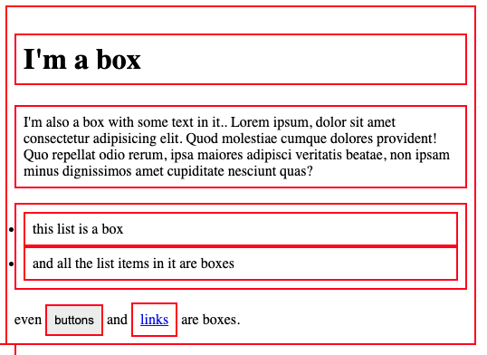
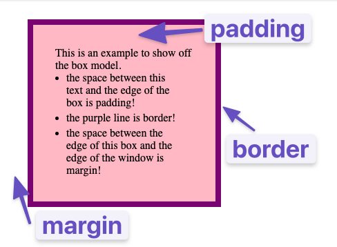

# Hướng dẫn học HTML/CSS khá là nhanh

## Phần 1: HTML

### HTML CSS là gì?

HTML (HyperText Markup Language) là ngôn ngữ đánh dấu cấu trúc nội dung trang web, CSS (Cascading Style Sheets) là ngôn ngữ tạo kiểu dáng cho trang web. HTML tạo bộ khung, CSS trang trí bộ khung đó.


```html
<!DOCTYPE html>
<html>
    <head>
        <title>Ví dụ HTML & CSS</title>
        <style>
            body {
                font-family: Arial, sans-serif;
                color: #333;
            }
            h1 {
                color: blue;
            }
        </style>
    </head>
    <body>
        <h1>Đây là tiêu đề</h1>
        <p>Đây là đoạn văn bản.</p>
    </body>
</html>
```

### Cần học cách sử dụng Dev Tools
Đọc/xem một trong những hướng dẫn dưới đây

- [Chrome DevTools - Crash Course](https://www.youtube.com/watch?v=gTVpBbFWry8)
- [A Detailed Guide to Chrome DevTools](https://www.headspin.io/blog/chrome-devtools-a-complete-guide)
- [Chrome Developer Tools và Cách Sử Dụng: Hướng Dẫn Chi Tiết](https://websitehcm.com/chrome-developer-tools-va-cach-su-dung/)

### Cài đặt môi trường, công cụ cần thiết để bắt đầu học HTML CSS

Theo tiêu chuẩn là cài đặt [VSCode](https://code.visualstudio.com/) (Hoặc [VSCodium](https://vscodium.com/)). Rồi bạn tìm mục **Extensions**, tìm những Addons có từ khóa HTML/CSS, JS và chọn bừa :smile: cộng với tải **Live Server** là xong.

### Cấu trúc tệp HTML

File HTML cơ bản có cấu trúc:

* `<!DOCTYPE html>`: Khai báo loại tài liệu HTML5.
* `<html>`: Thẻ gốc của trang HTML.
* `<head>`: Chứa meta thông tin (tiêu đề, CSS, JavaScript...).
* `<body>`: Chứa nội dung hiển thị trên trang web.


```html
<!DOCTYPE html>
<html lang="vi">
<head>
    <meta charset="UTF-8">
    <title>Tiêu đề trang</title>
    <link rel="stylesheet" href="style.css">
</head>
<body>
    <script src="script.js"></script>
</body>
</html>
```

### Comments trong HTML

Comment (chú thích) trong HTML giúp ghi chú, giải thích code, hoặc tạm ẩn code mà không ảnh hưởng đến hiển thị.

**Cú pháp:** `<!--[Đoạn này sẽ là nơi viết văn bản cần chú trích]-->`

```html
<!--Ôi không bầu trời màu xanh!-->
<p>Người</p>
```

### Những thẻ HTML thông dụng

HTML có nhiều thẻ khác nhau, mỗi thẻ có chức năng riêng để tạo cấu trúc và nội dung:

* Thẻ tiêu đề: `<h1>` - `<h6>` (quan trọng nhất là `<h1>`).
* Thẻ đoạn văn: `<p>`.
* Thẻ liên kết: `<a>` (`href` attribute để chỉ đích đến link).
* Thẻ hình ảnh: `` (`src` attribute để chỉ đường dẫn ảnh, `alt` attribute cho text thay thế).
* Thẻ danh sách: `<ul>` (danh sách không thứ tự), `<ol>` (danh sách thứ tự), `<li>` (item trong danh sách).
* Thẻ div và span: `<div>` (khối), `<span>` (nội tuyến), dùng để nhóm các phần tử và style.
* Thẻ form: `<form>`, `<input>`, `<button>`, `<textarea>`, `<select>`, `<label>`.
* Thẻ table: `<table>`, `<tr>` (row), `<th>` (header cell), `<td>` (data cell).


```html
<h1>Tiêu đề chính</h1>
<p>Đây là một đoạn văn bản.</p>
<a href="https://example.com">Bạn có muốn xem phim trên phimmoi không?</a>

<ul>
    <li>Item 1</li>
    <li>Item 2</li>
</ul>
<ol>
    <li>Item</li>
    <li>Item</li>
</ol>

<div>
    <p>Đây là một div chứa đoạn văn. <span>Khoan đã cái gì đây....</span></p>
</div>
```

### Attributes trong HTML

Attributes (thuộc tính) cung cấp thông tin bổ sung cho thẻ HTML, giúp điều chỉnh hành vi hoặc hiển thị của thẻ. Cú pháp: `attribute="value"` (nằm trong thẻ mở).


```html
<a href="https://f8.edu.vn" target="_blank">Liên kết F8 (mở tab mới)</a>

<div class="container" id="main-content">Nội dung</div>
```

## Phần 2: CSS

### Cách sử dụng CSS trong HTML

Có 3 cách chính để sử dụng CSS trong HTML:

1.  **Inline CSS:** Viết trực tiếp trong thuộc tính `style` của thẻ HTML (ưu tiên cao nhất, ít dùng vì khó quản lý).
2.  **Internal CSS:** Viết trong thẻ `<style>` trong `<head>` của file HTML (dùng cho style riêng của trang).
3.  **External CSS:** Viết trong file CSS riêng (`.css`), liên kết đến HTML bằng thẻ `<link>` trong `<head>` (tốt nhất cho dự án lớn, dễ quản lý, tái sử dụng).

**`index.html`:**

```html
<!DOCTYPE html>
<html>
    <head>
        <title>Ví dụ External CSS</title>
        <!--Dùng CSS từ tệp ngoài như này-->
        <link rel="stylesheet" href="style.css">
    </head>
    <body>
        <h1>Tiêu đề</h1>
        <p>Đoạn văn bản.</p>
    </body>
</html>
```

**`style.css`:**

```css
body {
    font-family: Arial, sans-serif;
}
h1 {
    color: red;
}
```

### ID và Class trong CSS selectors

CSS selectors (bộ chọn) để chọn các phần tử HTML để style. ID và Class là 2 loại selector quan trọng:

* **ID selector:** Chọn phần tử HTML có `id` attribute tương ứng. Bắt đầu bằng `#`. ID là duy nhất trên trang.
* **Class selector:** Chọn các phần tử HTML có `class` attribute tương ứng. Bắt đầu bằng `.`. Class có thể dùng cho nhiều phần tử.


**`index.html`:**

```html
<!DOCTYPE html>
<html>
<head>
    <title>Ví dụ ID và Class</title>
    <link rel="stylesheet" href="style.css">
</head>
<body>
    <h1 id="main-title">Tiêu đề chính</h1>
    <p class="paragraph">Đoạn văn bản 1.</p>
    <p class="paragraph special-text">Đoạn văn bản 2 (class đặc biệt).</p>
</body>
</html>
```

**`style.css`:**

```css
#main-title { /* ID selector */
    color: green;
    text-align: center;
}
.paragraph { /* Class selector */
    font-size: 16px;
    line-height: 1.5;
}
.special-text { /* Class selector cho class "special-text" */
    font-weight: bold;
}
```

### Mức độ ưu tiên trong CSS

Khi có nhiều CSS rules cùng style một element bất kì, trình duyệt áp dụng mức độ ưu tiên để quyết định rule nào được dùng:

1. Inline CSS (cao nhất). Kiểu như: `<p style="color: pink;">Màu hồng như cuộc sống của bạn.</p>`
2. ID selectors. Kiểu `<p id="viet-nam">ID là độc nhất</p>`
3. Class selectors, attribute selectors, pseudo-classes. `<p id="con-nguoi">Có khá nhiều chủng tộc, chúng tôi là Class Con người.</p>`
4. Element selectors, pseudo-elements (thấp nhất). Kiểu trong CSS sẽ chọn `p, h1` các thứ thay vì `.con-nguoi, #viet-nam`.
5. !important (cực cao, nên hạn chế dùng). Không dùng nên không cho ví dụ.

**`index.html`:**

```html
<!DOCTYPE html>
<html>
<head>
    <title>Mức độ ưu tiên CSS</title>
    <link rel="stylesheet" href="style.css">
</head>
<body>
    <p id="para-id" class="para-class" style="color: purple;">
        Đoạn văn bản này có nhiều style.
    </p>
</body>
</html>
```

**`style.css`:**

```css
p { /* Element selector (thấp nhất) */
    color: blue;
}
.para-class { /* Class selector */
    color: orange;
}
#para-id { /* ID selector */
    color: red;
}
```

Đoạn văn bản sẽ có màu **tím** (inline CSS ưu tiên nhất). Nếu bỏ inline style, sẽ có màu **đỏ** (ID selector ưu tiên hơn class và element).

### Biến trong CSS (CSS Variable)

CSS Variables (biến CSS) cho phép bạn định nghĩa các giá trị có thể tái sử dụng trong CSS, giúp code dễ bảo trì và tùy biến.

Khai báo biến: `--variable-name: value;` (khai báo trong `:root` selector để global, hoặc trong selector khác để local. Đọc thêm ở ví dụ dưới). Rồi khi sử dụng biến thì là `var(--variable-name)`


```css
:root { /* Global variables */
    --primary-color: blue;
    --font-size-large: 20px;
}

body {
    font-family: Arial, sans-serif;
    color: var(--primary-color); /* Sử dụng biến */
}

h1 {
    color: var(--primary-color);
    font-size: var(--font-size-large);
}
```

### CSS Units là gì?

CSS Units (đơn vị CSS) xác định kích thước, khoảng cách, độ dài... trong CSS. Có 2 loại chính:

**Absolute units:** Cố định, không thay đổi theo môi trường (px, cm, mm, in, pt, pc). `px` (pixel) phổ biến nhất cho web.

**Relative units:** Tương đối, thay đổi theo môi trường (%, em, rem, vw, vh).

* `%`: Phần trăm so với phần tử cha.
* `em`: Tương đối với `font-size` của phần tử cha.
* `rem`: Tương đối với `font-size` của thẻ gốc `<html>`.
* `vw`, `vh`: Phần trăm chiều rộng, chiều cao viewport (cửa sổ trình duyệt).

(Đọc choáng cái đầu =D Nên thôi cứ đọc qua qua gòi xem cái Video trên Youtube nhé: )

```css
body {
    font-size: 16px; /* Pixel (absolute) */
}

h1 {
    font-size: 2em; /* em (relative to body font-size) -> 32px */
}

div {
    width: 50%; /* % (relative to parent width) */
    padding: 10px; /* Pixel (absolute) */
}
```

### Box Model

Xàm xàm chút:

> The first important concept that you need to understand to be successful in CSS is **the box model**. It isn’t complicated, but skipping over it now would cause you much frustration down the line.
>
> Every single thing on a webpage is a rectangular box. These boxes can have other boxes in them and can sit alongside one another. You can get a rough idea of how this works by applying an outline to every element on the page like this:

```css
* {
  outline: 2px solid red;
}
```
Nó sẽ trông thế này:



### Padding (CSS)

`padding` tạo khoảng trắng bên trong **viền** (cái viền ở đây chính là cái `border`) của phần tử, đẩy nội dung ra xa viền. Có thể set `padding-top`, `padding-right`, `padding-bottom`, `padding-left` hoặc `padding` shorthand (top right bottom left).

Bạn có thể nhìn hình dưới đây để thấy mối tương quan giữa padding, border và margin:


- `padding` increases the space between the border of a box and the content of the box.
- `border` adds space (even if it’s only a pixel or two) between the margin and the padding.
- `margin` increases the space between the borders of a box and the borders of adjacent boxes.



```css
div {
    width: 200px;
    height: 100px;
    background-color: lightblue;
    border: 1px solid black;
    padding: 20px; /* Padding đều 4 phía 20px */
}
```

Còn cái padding shorthand thì đơn giản là

```css
.con-nguoi {
    /* Đi theo hướng: 
       top -> right -> bottom -> left 
       Đi theo chiều kim đồng hồ, bắt đầu từ số 12 trước =)), cách nhớ đó.
    */
    padding: 10px 5px   20px   30px;
    /*Đây:   top  right bottom  left*/
}
```

### Border (CSS)

`border` tạo viền xung quanh phần tử. Các thuộc tính:

* `border-width`: Độ dày viền (px, em...).
* `border-style`: Kiểu viền (solid, dashed, dotted, double...).
* `border-color`: Màu viền.
* `border` shorthand: `border: width style color;`
* `border-radius`: Bo tròn góc viền.


```css
div {
    width: 200px;
    height: 100px;
    background-color: lightblue;
    /*      width style color*/
    border: 5px   solid red; /* Viền đỏ, dày 5px, kiểu solid */
    border-radius: 10px; /* Bo tròn góc 10px */
}
```

### Margin (CSS)

`margin` tạo khoảng trắng bên ngoài **viền** của phần tử, đẩy phần tử ra xa các phần tử xung quanh. Tương tự padding, có `margin-top`, `margin-right`, `margin-bottom`, `margin-left` hoặc `margin` shorthand.


```css
div {
    width: 200px;
    height: 100px;
    background-color: lightblue;
    border: 1px solid black;
    margin-bottom: 30px; /* Margin dưới 30px, đẩy phần tử tiếp theo xuống */
}
```

### CSS Box-sizing

`box-sizing` quyết định cách tính tổng kích thước của phần tử (width, height) khi có `padding` và `border`.

* `content-box` (mặc định): `width` và `height` chỉ tính phần nội dung, `padding` và `border` cộng thêm vào tổng kích thước.
* `border-box`: `width` và `height` bao gồm cả `padding` và `border`. Thuận tiện hơn, dễ kiểm soát kích thước phần tử.


```css
.content-box {
    box-sizing: content-box; /* Mặc định */
    width: 200px;
    padding: 20px;
    border: 10px solid black;
    /* Tổng chiều rộng: 200px (width) + 20px*2 (padding) + 10px*2 (border) = 260px */
}

.border-box {
    box-sizing: border-box;
    width: 200px;
    padding: 20px;
    border: 10px solid black;
    /* Tổng chiều rộng: vẫn là 200px (width đã bao gồm padding và border) */
}
```

### CSS Background-clip

`background-clip` xác định vùng mà background (màu, ảnh) sẽ được hiển thị bên trong phần tử.

* `border-box` (mặc định): Background clip đến mép ngoài của viền.
* `padding-box`: Background clip đến mép ngoài của padding.
* `content-box`: Background clip đến mép ngoài của content box.
* `text`: Background clip theo hình dạng chữ (chỉ áp dụng cho text).


```css
div {
    width: 200px;
    height: 100px;
    background-color: lightblue;
    border: 20px dashed red;
    padding: 20px;
    background-clip: padding-box; /* Background chỉ hiển thị trong vùng padding và content */
}
```

### CSS background-image

`background-image` đặt ảnh nền cho phần tử. Giá trị là `url("path/to/image.jpg")` hoặc `linear-gradient()`, `radial-gradient()`...

```css
div {
    width: 300px;
    height: 200px;
    background-image: url("background.jpg"); /* Đặt ảnh nền */
    background-size: cover; /* Ảnh nền phủ kín div */
    color: white; /* Chữ màu trắng để dễ nhìn trên nền ảnh */
    text-align: center;
    padding-top: 50px;
}
```

### Thuộc tính background-size

`background-size` điều chỉnh kích thước ảnh nền. Các giá trị phổ biến:

* `auto` (mặc định): Kích thước ảnh gốc.
* `cover`: Ảnh nền phủ kín phần tử, có thể bị crop.
* `contain`: Ảnh nền vừa khít trong phần tử, có thể có khoảng trắng xung quanh.
* `px`, `%`: Kích thước cụ thể (px) hoặc phần trăm (%).


```css
div {
    width: 300px;
    height: 200px;
    background-image: url("background.jpg");
    background-size: cover; /* Ảnh nền phủ kín div */
}
```

### Thuộc tính Background-origin

`background-origin` xác định vị trí bắt đầu của background-image.

* `border-box` (mặc định): Bắt đầu từ mép trên-trái của border box.
* `padding-box`: Bắt đầu từ mép trên-trái của padding box.
* `content-box`: Bắt đầu từ mép trên-trái của content box.


```css
div {
    width: 200px;
    height: 100px;
    background-image: url("pattern.png"); /* Ảnh pattern nhỏ */
    border: 20px dashed red;
    padding: 20px;
    background-repeat: repeat; /* Lặp lại ảnh nền */
    background-origin: content-box; /* Ảnh nền bắt đầu từ content box */
}
```

### Thuộc tính Background-position

`background-position` định vị trí của ảnh nền trong phần tử. Giá trị:

* `top`, `bottom`, `left`, `right`, `center`.
* `px`, `%`: Vị trí cụ thể (px) hoặc phần trăm (%).
* Cặp giá trị: `background-position: horizontal vertical;` (ví dụ: `top center`, `50% 20px`).


```css
div {
    width: 300px;
    height: 200px;
    background-image: url("background.jpg");
    background-size: contain; /* Ảnh nền vừa khít */
    background-repeat: no-repeat; /* Không lặp lại ảnh nền */
    background-position: center; /* Ảnh nền ở giữa div */
}
```

### Cú pháp shorthand

CSS Shorthand (cú pháp rút gọn) giúp viết nhiều thuộc tính CSS liên quan trong một dòng. `background` shorthand gộp nhiều thuộc tính background: `background: color image repeat position/size origin clip;` (thứ tự không quan trọng, có thể bỏ qua một số giá trị).


```css
div {
    width: 300px;
    height: 200px;
    background: lightblue url("background.jpg") no-repeat center/cover padding-box;
    /* Rút gọn của:
        background-color: lightblue;
        background-image: url("background.jpg");
        background-repeat: no-repeat;
        background-position: center;
        background-size: cover;
        background-origin: padding-box;
    */
}
```

### CSS Functions

CSS Functions (hàm CSS) là các hàm dựng sẵn trong CSS để tạo ra các giá trị động hoặc phức tạp. Ví dụ:

* `rgb()`, `rgba()`, `hsl()`, `hsla()`: Hàm màu.
* `linear-gradient()`, `radial-gradient()`: Hàm tạo gradient màu.
* `calc()`: Hàm tính toán.
* `var()`: Hàm dùng biến CSS.


```css
div {
    width: 200px;
    height: 100px;
    background-color: rgba(0, 0, 255, 0.5); /* Màu xanh lam trong suốt */
    background-image: linear-gradient(to right, red, yellow); /* Gradient từ đỏ sang vàng */
    font-size: calc(100% - 20px); /* Tính toán font-size */
}
```

### CSS Pseudo classes

CSS Pseudo-classes (lớp giả) chọn các phần tử dựa trên trạng thái hoặc vị trí đặc biệt, không dựa trên class hay ID. Bắt đầu bằng `:`. Ví dụ:

* `:hover`: Khi chuột di vào.
* `:active`: Khi phần tử đang được click.
* `:focus`: Khi phần tử được focus (ví dụ input).
* `:first-child`, `:last-child`, `:nth-child()`: Chọn phần tử con đầu, cuối, thứ n.


```css
a:hover { /* Style link khi hover */
    color: red;
    text-decoration: none; /* Bỏ gạch chân khi hover */
}

li:first-child { /* Style item đầu tiên trong danh sách */
    font-weight: bold;
}
```

### Phần tử giả trong CSS

CSS Pseudo-elements (phần tử giả) tạo ra các phần tử "ảo" để style các phần cụ thể của phần tử thật. Bắt đầu bằng `::`. Ví dụ:

* `::before`, `::after`: Tạo phần tử ảo trước/sau nội dung phần tử thật.
* `::first-line`, `::first-letter`: Style dòng đầu, chữ cái đầu của text.


```css
p::first-line { /* Style dòng đầu tiên của đoạn văn */
    font-variant: small-caps; /* Chữ in hoa nhỏ */
}

a::before { /* Thêm icon trước link */
    content: "🔗 ";
}
```

### Thuộc tính Position

`position` xác định cách phần tử được định vị trong layout. Cái này xem video cho dễ hiểu nha [Learn CSS Positions in 4 minutes](https://www.youtube.com/watch?v=YEmdHbQBCSQ)

#### `position: relative` (tương đối):

* Phần tử vẫn ở vị trí bình thường trong luồng văn bản.
* `top`, `right`, `bottom`, `left` dịch chuyển phần tử **tương đối** so với vị trí ban đầu của nó.
* Không ảnh hưởng đến vị trí các phần tử khác.


```css
div {
    width: 100px;
    height: 100px;
    background-color: lightblue;
    position: relative; /* Định vị tương đối */
    left: 30px; /* Dịch sang phải 30px */
    top: 20px; /* Dịch xuống dưới 20px */
}
```

### Thuộc tính vị trí tuyệt đối

`position: absolute` (tuyệt đối):

* Phần tử bị loại khỏi luồng văn bản bình thường.
* Định vị **tuyệt đối** so với phần tử cha **gần nhất** có `position: relative`, `absolute`, `fixed` (nếu không có cha nào thì so với thẻ `<html>`).
* Các phần tử khác có thể "chèn" vào vị trí của phần tử absolute.


```html
<div style="position: relative; width: 300px; height: 200px; border: 1px solid black;">
    <div style="position: absolute; top: 50px; left: 50px; width: 100px; height: 100px; background-color: lightblue;">
        Absolute div
    </div>
    Relative container
</div>
```

### Thuộc tính Position: Fixed

`position: fixed` (cố định):

* Tương tự `absolute`: bị loại khỏi luồng văn bản.
* Định vị **cố định** so với **viewport** (cửa sổ trình duyệt).
* Không scroll theo trang, luôn ở vị trí cố định trên màn hình.


```css
div {
    position: fixed; /* Định vị cố định */
    top: 0;
    left: 0;
    width: 100%;
    background-color: lightblue;
    padding: 10px;
    text-align: center;
}
```

### Thuộc tính Position: Sticky

`position: sticky` (dính):

* Kết hợp `relative` và `fixed`.
* Ban đầu hoạt động như `relative` (trong luồng văn bản).
* Khi scroll đến một vị trí nhất định (set bằng `top`, `bottom`, `left`, `right`), nó sẽ "dính" lại như `fixed` trong phạm vi phần tử cha.


```css
div {
    position: sticky; /* Định vị sticky */
    top: 0; /* Dính vào mép trên khi scroll đến */
    background-color: lightblue;
    padding: 10px;
    margin-bottom: 500px; /* Tạo scroll để thấy hiệu ứng */
}
```

### Giới thiệu Flexbox

Flexbox là layout module mạnh mẽ trong CSS, giúp tạo layout linh hoạt, một chiều (chính hoặc phụ). Dùng cho layout thành phần, UI nhỏ.

* **Kích hoạt Flexbox:** `display: flex;` cho phần tử cha (container). Các phần tử con trực tiếp trở thành flex items.
* **Trục chính (main axis) và trục phụ (cross axis):** Flexbox layout dựa trên 2 trục này. Mặc định trục chính là ngang (row), trục phụ là dọc (column).

### Những thuộc tính CSS sử dụng trong Flexbox

**Thuộc tính cho container (phần tử cha):**

* `flex-direction`: Hướng trục chính (row, column, row-reverse, column-reverse).
* `justify-content`: Căn chỉnh các flex items trên trục chính (flex-start, flex-end, center, space-between, space-around, space-evenly).
* `align-items`: Căn chỉnh các flex items trên trục phụ (flex-start, flex-end, center, stretch, baseline).
* `flex-wrap`: Cho phép flex items xuống dòng khi không đủ chỗ (nowrap, wrap, wrap-reverse).
* `align-content`: Căn chỉnh các dòng flex items (khi `flex-wrap: wrap` hoặc `wrap-reverse`) trên trục phụ (flex-start, flex-end, center, space-between, space-around, stretch).

**Thuộc tính cho items (phần tử con):**

* `order`: Sắp xếp thứ tự item.
* `flex-grow`:  Item có thể lớn ra để lấp đầy không gian thừa.
* `flex-shrink`: Item có thể nhỏ lại khi không đủ chỗ.
* `flex-basis`: Kích thước cơ sở của item trước khi `flex-grow` và `flex-shrink` áp dụng.
* `align-self`: Ghi đè `align-items` cho item cụ thể.

### Học Flexbox CSS qua ví dụ

**Ví dụ (layout menu ngang):**

```html
<nav class="menu">
    <a href="#">Home</a>
    <a href="#">About</a>
    <a href="#">Services</a>
    <a href="#">Contact</a>
</nav>
```

```css
.menu {
    display: flex; /* Kích hoạt flexbox */
    justify-content: space-around; /* Các link cách đều nhau trên trục ngang */
    background-color: lightgray;
    padding: 10px;
}

.menu a {
    text-decoration: none;
    color: black;
    padding: 10px 15px;
}
```

### [Flexbox nâng cao] Liên hệ Flex model với các thuộc tính Flexbox trong CSS

Hiểu rõ flex container, flex items, trục chính, trục phụ, main size, cross size... giúp dùng Flexbox hiệu quả hơn. Các thuộc tính Flexbox điều khiển cách flex items phân bổ không gian trên trục chính và trục phụ.

### CSS BEM Là Gì? Đặt Tên CSS Class Theo Tiêu Chuẩn BEM

BEM (Block, Element, Modifier) là quy tắc đặt tên class CSS giúp code dễ đọc, dễ bảo trì, tránh xung đột.

* **Block:** Phần tử độc lập, tái sử dụng (ví dụ: `menu`, `button`). Class: `block`.
* **Element:** Phần con của Block, phụ thuộc vào Block (ví dụ: `menu__item`, `button__text`). Class: `block__element`.
* **Modifier:** Biến thể của Block hoặc Element, thay đổi style (ví dụ: `button--primary`, `menu__item--active`). Class: `block--modifier` hoặc `block__element--modifier`.


```html
<div class="button button--primary">
    <span class="button__text">Click me</span>
</div>
```

```css
.button { /* Block */
    padding: 10px 20px;
    border: none;
    border-radius: 5px;
}

.button--primary { /* Modifier cho Block */
    background-color: blue;
    color: white;
}

.button__text { /* Element của Block */
    font-size: 16px;
}
```

### Tối ưu performace khi sử dụng ảnh với srcset

`srcset` attribute của thẻ `` giúp cung cấp nhiều phiên bản ảnh với kích thước khác nhau, trình duyệt tự chọn ảnh phù hợp với kích thước màn hình, tối ưu hiệu suất tải trang, đặc biệt trên mobile.


```html

```

### CSS selectors cơ bản

Ôn lại các CSS selectors cơ bản:

* **Element selectors:** `p`, `h1`, `div`...
* **Class selectors:** `.class-name`
* **ID selectors:** `#id-name`
* **Attribute selectors:** `[attribute]`, `[attribute="value"]`...
* **Universal selector:** `*` (chọn tất cả phần tử).
* **Combinators:**
    * Descendant selector (space): `div p` (chọn `<p>` bên trong `<div>`).
    * Child selector (`>`): `div > p` (chọn `<p>` là con trực tiếp của `<div>`).
    * Adjacent sibling selector (`+`): `h1 + p` (chọn `<p>` ngay sau `<h1>`).
    * General sibling selector (`~`): `h1 ~ p` (chọn tất cả `<p>` là anh em của `<h1>`).